# Skyscraper Puzzle Solver

> **Note:** This is a working solution for the 4x4 Skyscraper puzzle problem.

## Overview

This project implements a recursive backtracking algorithm to solve the classic Skyscraper puzzle. The solver uses depth-first search with constraint propagation to find valid solutions for 4x4 grid configurations.

## Prerequisites

Before diving into the code, ensure you understand these fundamental concepts:

### Core Concepts
- **[Recursion](https://www.geeksforgeeks.org/introduction-to-recursion-2/)** - The foundation of our solving algorithm
- **[Call Stack](https://www.youtube.com/watch?v=aCPkszeKRa4&t=131s)** - Understanding how recursive calls are managed
- **[Binary Trees](https://www.w3schools.com/dsa/dsa_data_binarytrees.php)** - Visualize the call stack during recursion
- **[Depth-First Search](https://www.youtube.com/watch?v=cS-198wtfj0)** - The main recursive algorithm used
- **[Brute-Force vs. Backtracking](https://en.wikipedia.org/wiki/Brute-force_search)** - Understanding the solving approach
- **[Constraint Propagation](https://www.ibm.com/docs/en/icos/22.1.0?topic=optimizer-constraint-propagation)** - How local decisions propagate globally

### Additional Resources
- **[Play the Game](https://www.puzzle-skyscrapers.com/)** - Experience the puzzle firsthand
- **[Command Line Arguments](https://stackoverflow.com/questions/3024197/what-does-int-argc-char-argv-mean)** - Understanding program input

## Technical Implementation

### Libraries Used
- `#include <unistd.h>` - For `write(1, &c, 1)` function

> **Note:** We avoid `stdlib.h` and `malloc` by using hardcoded arrays for simplicity and automatic memory management.

## Architecture

The program operates in two distinct phases:

### 1. Input Parsing & Validation (`main.c`)

The program accepts exactly 2 command-line arguments:
1. Executable path
2. Edge clues as a space-delimited string

**Example Input:**
```bash
./a.exe "3 2 2 1 2 2 1 3 4 2 1 3 1 2 2 2"
```

**Validation Process:**
- Extract and convert string characters to integers
- Store clues in an array for solving reference
- Verify exactly 16 clues for 4x4 grid
- Initialize a 2D board array with zeros (empty cells)

### 2. Solving Phase

The solver employs a combination of:
- **Brute-force approach** - Systematic exploration of possibilities
- **Constraint propagation** - Local validation with global impact
- **Recursive depth-first traversal** - Tree-based solution search

## Algorithm Design

### Recursive Function Requirements

Every recursive function needs two fundamental components:

#### 1. Exit Condition (Base Case)
The solver exits when the board is completely solved, determined by three conditions:

1. **Completeness** - Every cell contains a value (no zeros)
2. **Edge Clue Satisfaction** - All row/column intersections satisfy their corresponding edge clues
3. **Uniqueness** - No duplicate tower heights in any row or column

#### 2. Recursive Condition
When the board isn't solved, the algorithm continues with backtracking:

1. **Cell Selection** - Identify the next empty cell `board[row][col]`
2. **Height Testing** - Try placing each possible tower height (1-4)
3. **Validation** - Apply constraint propagation to check partial board validity
4. **Recursion** - If valid, recursively explore deeper along that path
5. **Backtracking** - If invalid or no solution found, backtrack and try next height

### Tree Navigation Analogy

Think of the solving process for each cell as navigating a decision tree:

- **Root Node** - The starting board state (empty grid)
- **Levels** - Each level represents a board state after filling one more empty cell
- **Nodes** - Each node represents a partial board state at that point in the solving process
- **Branches** - From each board state, up to 4 branches emerge (one for each possible tower height 1-4)
- **Traversal** - Move down one branch at a time using depth-first search, exploring partial board configurations
- **Backtracking** - When a board state leads to a dead end (does not satisfy clue edge visibility or uniqueness constraints), backtrack to the previous state and try the next height option
- **Exploration** - This continues until either all possibilities are exhausted or we find a valid complete board

```mermaid
graph TD
    A["🏗️ Start: Empty 4x4 Board<br/>Find first empty cell (0,0)"] --> B["Try height = 1 at (0,0)"]
    A --> C["Try height = 2 at (0,0)"]
    A --> D["Try height = 3 at (0,0)"]
    A --> E["Try height = 4 at (0,0)"]
    
    B --> B1["✅ Valid? Check row/col duplicates"]
    B1 -->|"Valid"| B2["🔍 Recurse: Find next empty cell"]
    B1 -->|"Invalid"| B3["❌ Backtrack: Try next height"]
    
    B2 --> B2A["Try heights 1-4 at next position"]
    B2A --> B2B["Continue DFS..."]
    B2B --> B2C["🎯 All cells filled?"]
    B2C -->|"Yes"| B2D["🔎 check_board(): Validate all clues"]
    B2C -->|"No"| B2E["Continue to next empty cell"]
    
    B2D -->|"✅ All clues satisfied"| SUCCESS["🏆 SOLUTION FOUND!"]
    B2D -->|"❌ Clue violation"| BACKTRACK["⬅️ Backtrack: Reset cell to 0"]
    
    C --> C1["Check duplicates for height=2"]
    C1 -->|"Valid"| C2["Recurse deeper..."]
    C1 -->|"Invalid"| C3["Try height=3"]
    
    D --> D1["Check duplicates for height=3"]
    D1 -->|"Valid"| D2["Recurse deeper..."]
    D1 -->|"Invalid"| D3["Try height=4"]
    
    E --> E1["Check duplicates for height=4"]
    E1 -->|"Valid"| E2["Recurse deeper..."]
    E1 -->|"Invalid"| DEADEND["💀 Dead end: Backtrack"]
    
    BACKTRACK --> RETRY["🔄 Try different height at current cell"]
    DEADEND --> RETRY
    
    RETRY -->|"More heights to try"| B2A
    RETRY -->|"All heights exhausted"| BACKTRACK2["⬅️ Backtrack to previous cell"]
    
    BACKTRACK2 --> PREVLEVEL["Previous recursion level"]
    
    subgraph "Key Functions"
        F1["🔍 search_traverse_empty()<br/>Find next empty cell (row,col)"]
        F2["✅ check_no_duplicates()<br/>Validate row & column constraints"]
        F3["🎯 check_board()<br/>Validate all visibility clues:<br/>• Top→Bottom • Bottom→Top<br/>• Left→Right • Right→Left"]
    end
    
    subgraph "Clue Validation Details"
        G1["Clues[0-3]: Top→Bottom views"]
        G2["Clues[4-7]: Bottom→Top views"]
        G3["Clues[8-11]: Left→Right views"]  
        G4["Clues[12-15]: Right→Left views"]
    end
    
    style SUCCESS fill:#90EE90
    style DEADEND fill:#FFB6C1
    style BACKTRACK fill:#FFE4B5
    style A fill:#E6F3FF
    style F3 fill:#FFFACD
```



## Clue System & Validation

### Visual Clue Layout

The 16 clues surround the 4x4 grid, representing how many skyscrapers are visible from each edge:

```
       Top Clues (0-3)
        0   1   2   3
      ┌───┬───┬───┬───┐
   8  │   │   │   │   │  4
      ├───┼───┼───┼───┤
   9  │   │   │   │   │  5
      ├───┼───┼───┼───┤
  10  │   │   │   │   │  6
      ├───┼───┼───┼───┤
  11  │   │   │   │   │  7
      └───┴───┴───┴───┘
        15  14  13  12
     Bottom Clues (12-15)
```

### Index Mapping Logic

### Clue Validation Process

The `check_board()` function validates all 16 clues by calling the appropriate visibility checking function for each viewing direction (top -> bottom -> left -> right):

```c
int check_board(int board[4][4], int *clues)
{
    int i = 0;
    while (clues[i])
    {
        // Top → Bottom views (clues[0-3])
        if (i >= 0 && i <= 3 && 
            !check_col_top_to_bottom(board, i, clues[i] - 1))
            return (0);
        
        // Bottom → Top views (clues[4-7]) 
        if (i >= 4 && i <= 7 && 
            !check_col_bottom_to_top(board, i - 4, clues[i] - 1))
            return (0);
        
        // Left → Right views (clues[8-11])
        if (i >= 8 && i <= 11 && 
            !check_row_left_to_right(board, i - 8, clues[i] - 1))
            return (0);
        
        // Right → Left views (clues[12-15])
        if (i >= 12 && i <= 15 && 
            !check_row_right_to_left(board, i - 12, clues[i] - 1))
            return (0);
        i++;
    }
    return (1);
}
```

### Key Implementation Details

1. **Index Shifting**: 
   - Column views: `clues[i]` maps directly to column `i`
   - Row views: `clues[i]` maps to row `(i - 8)` for left→right, `(i - 12)` for right→left

2. **Visibility Rules**:
   - A building is visible if it's taller than all buildings in front of it
   - The first building in any row/column is always counted as visible
   - Subsequent buildings are only counted if they're taller than the current maximum
   - `clues[i] - 1` to translate clues to zero-index for visibility check, with `visible = 0` initally.

3. **Validation Order**:
   - Columns are checked first (top→bottom, then bottom→top)
   - Rows are checked second (left→right, then right→left)
   - All 16 clues must be satisfied for a board to be valid

## File Structure

- `main.c` - Input parsing, validation, and program entry point
- `solve.c` - Core solving algorithm and recursive functions
- `check.c` - Validation and constraint checking functions